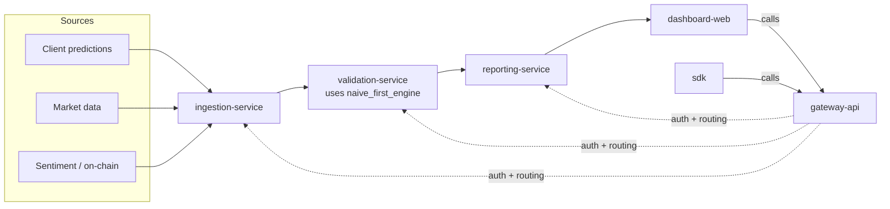

# Naive-First

Validation/audit infrastructure for predictive models in crypto and financial markets — born from a Master's thesis that rigorously tested whether ML models can beat a naive benchmark forecasting Bitcoin returns, and found they mostly can't. That result is the product: **Naive-First sells the validation protocol itself** (leakage detection, naive-first benchmarking, Diebold–Mariano significance testing, honest instability reporting), not a trading signal.

> **Not a Bitcoin-prediction or trading-signal product.** Every design decision in this repo is bound by that line — see [`CLAUDE.md`](CLAUDE.md) for the non-negotiable positioning rules any contributor (human or agent) must follow.

## Why this exists

Under leakage-free, purged walk-forward validation across 1h/6h/24h Bitcoin return horizons, no tested ML model (OLS, Random Forest, ARIMA, LSTM) beat a naive benchmark (Naive0) in a stable, statistically significant way. Best directional accuracy observed: 52.51% — barely above chance. Full writeup: [`docs/da-tese-ao-produto.md`](docs/da-tese-ao-produto.md).

That's not a failed thesis — it's the market's honest answer, and it's exactly what most "AI trading signal" products don't tell you. Naive-First turns the *methodology* that produced that honest answer into a product: an auditor that tells a fund, exchange, or compliance team whether *their* model actually beats naive, under the same rigor.

## Architecture at a glance



Full technical design: [`docs/solution-design.md`](docs/solution-design.md) (data flow, storage, multi-tenancy) and [`docs/implementation-plan.md`](docs/implementation-plan.md) (module boundaries, design patterns, trigger-based build order).

## Repo layout

Monorepo. `libs/` = shared code, zero I/O. `services/` = independently deployable, each owning its own data.

| Module | What it does | Status |
|---|---|---|
| [`libs/naive_first_engine`](libs/naive_first_engine/) | Core IP: walk-forward splitting + purge gap, naive baselines, metrics, Diebold–Mariano test | 🚧 in progress |
| [`libs/common`](libs/common/) | Shared tenant context, schemas | planned |
| [`libs/sdk`](libs/sdk/) | Python client for external "bring your own predictions" users | planned |
| [`services/gateway-api`](services/gateway-api/) | Auth, tenant routing, public REST contract | planned |
| [`services/ingestion-service`](services/ingestion-service/) | Upload API + market/on-chain/sentiment crawlers | 🚧 connectors live (price, hash-rate, addresses; Reddit sentiment needs credentials) |
| [`services/validation-service`](services/validation-service/) | Wraps `naive_first_engine` as a REST service | planned |
| [`services/reporting-service`](services/reporting-service/) | Renders audit reports from validation runs | planned |
| [`services/dashboard-web`](services/dashboard-web/) | Client-facing UI | planned |
| [`services/economic-service`](services/economic-service/) | Transaction cost/slippage modeling — **deferred until a model proves it beats naive** | deferred |
| [`infra/`](infra/) | Docker Compose, migrations | planned |
| [`research/`](research/) | Applied research (regime models, broader model comparison) | planned |
| [`jupyter_notebooks/`](jupyter_notebooks/) | Original thesis research notebooks (reference material, not a runtime dependency) | reference |

Every module's own README states what it owns, what it doesn't, and its build trigger — see [`docs/implementation-plan.md`](docs/implementation-plan.md) section 6 for the full trigger table ("create this when X happens," not a calendar).

## How work gets planned and built

This repo uses a small agent squad instead of ad-hoc prompting for feature work — Product Owner → PM → Tech Lead → dev agents, each with a narrow role and repo-tracked output, with human approval gates after the backlog and after the sprint plan. Full process: [`docs/process/agile-squad-workflow.md`](docs/process/agile-squad-workflow.md). Agent definitions: [`.claude/agents/`](.claude/agents/).

Current backlog: [`docs/product/backlog-naive-first-engine.md`](docs/product/backlog-naive-first-engine.md).

## Getting started

Nothing is runnable as a full stack yet — `naive_first_engine` (the only module past its build trigger) is the current focus. Once it exists:

```bash
cd libs/naive_first_engine
uv sync
uv run pytest
```

The ingestion connectors are runnable today, standalone (no service wrapper yet):

```bash
cd services/ingestion-service
pip install -r requirements.txt
python -m connectors.binance_price          # no credentials needed
python -m connectors.blockchain_onchain      # no credentials needed
python -m connectors.reddit_sentiment        # needs REDDIT_CLIENT_ID / SECRET / USER_AGENT
```

See [`services/ingestion-service/data/raw/_platform/PROVENANCE.md`](services/ingestion-service/data/raw/_platform/PROVENANCE.md) for what historical data is already seeded and where each connector picks up from.

## License

See [`LICENSE`](LICENSE).
