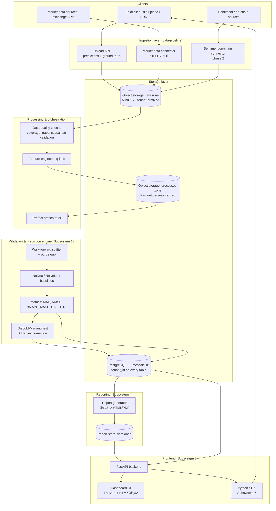

# Solution design — Naive-First platform

> Scope decisions locked in for this design (2026-08-05): local-first deployment (Docker Compose, cloud-portable), **multi-tenant from day one** (external pilot clients submit data/predictions immediately), Python end-to-end with a lightweight server-rendered frontend. Revisit if these assumptions change.

This document covers the technical path from raw data → storage → processing → validation/prediction → reports → frontends, for the subsystems defined in [da-tese-ao-produto.md](da-tese-ao-produto.md) section 2.3: primarily **Subsystem 1 (validation-engine)**, **2 (data-pipeline)**, **3 (dashboard)**, **4 (audit-reports)**, and **6 (api-sdk)**. Subsystem 5 (economic-module) is scoped but deliberately built last, per the roadmap.

---

## 1. Design principles (carried over from the ethical/methodological constraints)

1. **Naive-first is structural, not optional.** Every validation run computes Naive0/NaiveLast baselines automatically — there is no code path that scores a model without them.
2. **No arbitrary code execution from clients in the MVP.** Clients submit *predictions* (CSV/Parquet + ground-truth timestamps), not model binaries. This sidesteps a large sandboxing/security problem and matches the "bring your own model" framing in section 2.3.6 — running client model artifacts is a deliberate phase-2+ decision, not an MVP requirement.
3. **Tenant isolation is a first-class concern from the first commit**, not retrofitted — every table, storage prefix, and API call is tenant-scoped, even though there's only one physical deployment.
4. **Everything the validation engine touches is reproducible and auditable**: every run persists its split boundaries, config (purge gap, horizon), and raw metrics — never just a final report number.

---

## 2. High-level architecture



---

## 3. Component breakdown

### 3.1 Ingestion layer (`data-pipeline/`)

| Component | Responsibility | Notes |
|---|---|---|
| Upload API | Accepts client predictions + ground truth (CSV/Parquet via signed upload or direct POST) | Validates schema with Pydantic (timestamp, horizon, value columns) before landing in raw zone |
| Market data connector | Pulls OHLCV from exchange APIs (e.g. Binance) on a schedule | `ccxt` or direct REST client; idempotent writes keyed by (symbol, timestamp) |
| Sentiment/on-chain connector | Phase 2. Pulls news/social sentiment and on-chain metrics, with **documented causal lag** (timestamp of availability, not timestamp of event) | This is the exact gap the thesis flagged (section 1.6) — the connector must record *when data became known*, not just when it happened, or the leakage problem reappears one layer up |
| Data quality gate | Checks coverage %, gap detection, timestamp monotonicity, causal-lag consistency | Runs before any processed data is exposed to the validation engine; failing datasets are quarantined with a report, not silently dropped |

All ingestion writes land in the **raw zone** first (immutable, tenant-prefixed, source-of-truth) before any transformation — this is what makes runs reproducible and audits defensible ("show me exactly what data this run saw").

### 3.2 Storage layer

| Store | Technology | Contents |
|---|---|---|
| Raw zone | Object storage (MinIO locally, swaps to S3 in cloud) | Immutable landed files: client uploads, raw OHLCV pulls, raw sentiment/on-chain pulls. Path scheme: `raw/{tenant_id}/{source}/{date}/...` |
| Processed zone | Object storage, Parquet | Feature-engineered, split-ready datasets. Path scheme: `processed/{tenant_id}/{dataset_id}/{version}/...` |
| Operational DB | PostgreSQL + TimescaleDB extension | Tenants, users, API keys, dataset metadata, split definitions, run configs, per-split metrics, DM test results, report index. TimescaleDB hypertables for time-series metrics/OHLCV if queried directly rather than via Parquet |
| Report store | Object storage + Postgres index | Generated HTML/PDF audit reports, versioned, tenant-prefixed |

**Multi-tenancy model**: single Postgres instance, `tenant_id` column + row-level security policy on every table (not separate DBs per tenant — simplest operationally for a pilot-stage deployment, still enforces hard isolation). Object storage uses tenant-prefixed paths plus bucket policies. This is the standard "pool" multi-tenancy pattern and is the right choice until a client specifically requires physical isolation (e.g. a large fund with its own compliance requirement) — bridge that with a dedicated bucket/schema per tenant later if it comes up, don't build it now.

### 3.3 Processing & orchestration

- **Orchestrator: Prefect** (not Airflow) — Pythonic, lightweight to run locally via `docker compose`, and its Cloud tier is a clean upgrade path if this needs to run unattended for pilot clients later. Flows: `ingest_market_data`, `ingest_client_predictions`, `run_data_quality_checks`, `run_validation`, `generate_report`.
- **Feature engineering jobs**: pandas/polars transforms producing the processed Parquet datasets; deterministic, versioned by config hash so a run can be reproduced exactly.
- Processing jobs never touch data across the purge gap boundary — this is enforced in the validation engine itself (3.4), not hoped for in the feature code.

### 3.4 Validation & prediction engine (`validation-engine/` — Subsystem 1, core IP)

This is the part to extract from the thesis scripts (`run_arima_returns.py`, `run_rf_noleak.py`, `run_sarima_only.py`) into a standalone pip-installable library, e.g. `naive_first_engine`:

```
naive_first_engine/
├── splitting.py      # rolling-origin walk-forward + configurable purge gap
├── baselines.py       # Naive0, NaiveLast
├── metrics.py          # MAE, RMSE, sMAPE, MASE, DA, F1, out-of-sample R²
├── dm_test.py            # Diebold-Mariano, with Harvey et al. 1997 long-run
                            #  variance correction for overlapping horizons
└── report_schema.py     # typed result objects consumed by report generator
```

- Pure functions, dataset-agnostic (no Bitcoin-specific assumptions), fully unit-testable against known reference values.
- Runs as a Prefect flow: given a processed dataset + config (horizon, purge gap, model predictions), executes the full protocol from section 1.2 and writes per-split results to Postgres.
- This library is also the thing eventually licensed/open-cored per the revenue model (section 2.4) — build it decoupled from the platform's web/API code from the start so it can be published standalone later without a rewrite.

### 3.5 Reporting (`audit-reports/` — Subsystem 4)

- **Report generator**: Jinja2 templates implementing the exact structure defined in the `naive-first-audit` skill (scope, leakage checklist, results table, verdict, statistical-vs-economic disclaimer, recommendations) → rendered to HTML, optionally to PDF via WeasyPrint.
- Reports are generated automatically at the end of a validation run and stored versioned — a client can request a re-audit after fixing an issue and both reports remain comparable.
- The **leakage checklist** in the report is populated programmatically where possible (e.g. "purge gap >= horizon" is a fact the engine already knows) rather than filled in by hand — reduces both effort and the chance of an inconsistent report.

### 3.6 Frontend (`dashboard/` — Subsystem 3, `api-sdk/` — Subsystem 6)

- **Backend**: FastAPI. Endpoints for auth, dataset upload, triggering validation runs, polling run status, fetching reports, dashboard queries (metrics over time per model).
- **Dashboard UI**: FastAPI + Jinja2 + HTMX for the MVP — server-rendered, no separate SPA build/deploy pipeline, fast to iterate on, matches "lightweight web frontend." Pages: tenant login, dataset/run list, run detail (metrics table + DM results, matching the thesis-style tables), report viewer, degradation alerts view (once a model is monitored continuously, per section 2.3.3).
- **Auth**: JWT-based sessions for the dashboard UI, API keys for programmatic access (SDK). `tenant_id` embedded in the token/key, enforced at the API layer and again at the DB row-level-security layer (defense in depth, cheap to add now).
- **Python SDK**: thin wrapper around the FastAPI endpoints (`naive_first_sdk`) — upload predictions, trigger a run, fetch a report — this is what external clients use for the "bring your own model" flow instead of a UI upload.

---

## 4. Data model sketch (Postgres)

```
tenants(id, name, created_at)
users(id, tenant_id, email, role, ...)
api_keys(id, tenant_id, key_hash, created_at, revoked_at)

datasets(id, tenant_id, source, kind[predictions|market|sentiment|onchain],
         raw_path, schema_version, ingested_at)

runs(id, tenant_id, dataset_id, horizon, purge_gap_hours,
     split_config, status, created_at, completed_at)

split_results(id, run_id, split_index, train_start, train_end,
              purge_start, purge_end, test_start, test_end,
              model_mae, model_rmse, model_da, model_f1,
              naive0_mae, naive0_rmse, ...,
              dm_statistic, dm_pvalue, dm_verdict)

reports(id, run_id, version, storage_path, generated_at)
```

`split_results` is intentionally wide and per-split (not just aggregated) — this is what lets the dashboard show "is the model still beating naive this month" (Subsystem 3) rather than only a one-time verdict, and is exactly the artifact the thesis's own appendix was missing (section 1.6, "explainability/artifacts per split").

---

## 5. Deployment (local-first, cloud-portable)

`docker-compose.yml` services for local/pilot deployment:

| Service | Image/base | Purpose |
|---|---|---|
| `api` | FastAPI app | REST API + dashboard (Jinja2/HTMX served from same app initially) |
| `worker` | Prefect agent | Runs ingestion/processing/validation/report flows |
| `postgres` | `timescale/timescaledb` | Operational DB |
| `minio` | `minio/minio` | S3-compatible object storage (raw/processed/report zones) |
| `redis` | `redis` | Prefect task queue / caching (if needed) |

Cloud migration path (no redesign needed, only swaps): `postgres` → managed Postgres/Timescale Cloud, `minio` → S3, `worker`/`api` → containers on ECS Fargate or a small Kubernetes cluster, Prefect local agent → Prefect Cloud or self-hosted Prefect server. Because tenant isolation is already enforced at the data-model level, this migration doesn't require re-architecting multi-tenancy later.

### 5.1 Hosting decision (2026-08-05)

Docker Compose stays the local dev environment (above). For actual hosting, **not Vercel** for the backend: Vercel runs serverless/edge functions and static/SSR frontends, not arbitrary long-running Docker containers, stateful Postgres/Redis/MinIO, or Prefect workers — none of `gateway-api`, `validation-service`, `ingestion-service`, `reporting-service`, Postgres, Redis, or the worker process fit that model.

- **Backend (`gateway-api`, `validation-service`, `ingestion-service`, `reporting-service`, worker, Postgres, Redis)**: deploy to **Heroku** (or an equivalent container-friendly PaaS — Render/Railway are peers if Heroku's pricing/limits don't fit later). Heroku runs the same Docker containers built for local Compose directly, with managed Postgres/Redis add-ons — minimal drift from local dev.
- **Frontend (`dashboard-web`)**: Vercel is a legitimate target *only if* it's rewritten as a Next.js app calling `gateway-api` over HTTPS — the FastAPI+HTMX MVP described in section 3.6 doesn't run on Vercel as-is. Until/unless that rewrite happens, `dashboard-web` deploys alongside the rest of the backend on Heroku too.

Revisit this as an ADR (`docs/adr/`) if it changes rather than silently drifting from it.

---

## 6. Build order (maps to roadmap, section 2.6, adjusted for "external pilots from day one")

1. **`naive_first_engine` library** (3.4) — splitting, baselines, metrics, DM test, unit-tested against the thesis's own published numbers (section 1.3) as a regression check.
2. **Minimal ingestion + storage** — upload API for predictions/ground truth, raw zone, Postgres schema, one Prefect flow (`run_validation`) wired end-to-end for a single tenant.
3. **Tenant/auth scaffolding** — since pilots start immediately, this can't be deferred: tenants/users/api_keys tables, JWT + API key auth, row-level security, before onboarding the first external client.
4. **Report generator** (3.5) — Jinja2 templates matching the skill's report structure, wired to run completion.
5. **Dashboard MVP** (3.6) — run list, run detail, report viewer. This is the client-facing surface for the first pilots.
6. **Market data connector + data quality gate** (3.1) — once predictions-only audits are working, add OHLCV ingestion to support clients who want the platform to source ground truth rather than upload it themselves.
7. **Continuous monitoring** — recurring validation runs on a schedule, degradation alerts, the "is it still beating naive" view — this is what turns a one-off audit into the SaaS dashboard product.
8. **Sentiment/on-chain connectors + economic module** — deliberately after the above, per the original roadmap's phase ordering.

---

## 7. Open questions to resolve before build starts

- **Report delivery format for pilots**: HTML-in-dashboard only, or also downloadable PDF? (Affects whether WeasyPrint/wkhtmltopdf needs to be in the stack from day one.)
- **Client prediction submission cadence**: one-off audit only, or recurring feed (needed for Subsystem 3's continuous monitoring) — determines whether the upload API needs to support streaming/incremental uploads early or can start as one-shot batch files.
- **Pilot client count and expected data volume** — affects whether local Docker Compose can carry the actual pilot phase or whether cloud deployment needs to happen sooner than "phase 2."
---

## 8. Per-tenant ingestion data pipeline (TimescaleDB schema, `ingestion-service` API, credential encryption, unified ops dashboard)

Locked in by the product owner (2026-08-25), superseding/refining `docs/product/backlog-ingestion-pipeline-integration.md`'s `INGEST-002`/`INGEST-004`/`INGEST-009` where noted below. This section is the technical design the Tech Lead grooms into tickets; it does not re-litigate the six locked decisions (dataset semantics, schema shape, credential encryption, backfill, per-tenant crawlers, dashboard) - see the backlog for their original framing.

Ground truth confirmed by reading code, not assumed: `infra/docker-compose.yml`'s `postgres` service already runs `timescale/timescaledb:latest-pg16`, and `validation-service`'s `split_results` table is already a real hypertable (`migrations/versions/0004_convert_split_results_to_hypertable.py`, `INF-010`). **No new container, port, or database product is introduced anywhere in this section** - this is a new `ingestion` schema plus hypertables on the existing Postgres instance, exactly the way `validation-service` already did it.

### 8.1 Dataset semantics (binding, drives every contract below)

A **dataset** is `{tenant_id, source}` - a tenant's ongoing, continuously-growing hypertable partition, not a discrete snapshot. There is no `datasets` row with a fixed `raw_path`/`ingested_at` the way section 4's old sketch implied for the pre-DB CSV era; that row-per-snapshot shape is retired for ingestion data specifically (it's still fine for anything section 4 covers that isn't ingestion). Picking a dataset for a validation run means selecting `{tenant, source}` **and a time-range slice at submission time** - this is why every dataset-reading endpoint below takes `start`/`end` query parameters rather than resolving to one static blob. Contrast with a **crawl run**: one execution of a connector appending rows to a dataset (an event, tracked in `crawl_runs`); a dataset is the table it appends to. See `CONTEXT.md`'s "Dataset"/"Seed data" glossary entries - this section operationalizes those definitions, it doesn't restate them.

This refines `INGEST-009`'s original sketch (which proposed a single static `id = "{source}"` with no time-range parameter on the read endpoint) - the fix is additive: `GET /datasets` still lists one entry per `{tenant, source}` for discovery, but the endpoint that actually returns values now requires a `start`/`end` range instead of implicitly returning "the whole table." See `docs/adr/0005-dataset-is-a-continuous-tenant-source-table.md`.

### 8.2 TimescaleDB schema (`ingestion` schema, mirrors `identity`/`validation`/`reporting`)

One hypertable per source family (not per tenant, not per source instance) - decision #2. Sketch:

```sql
-- ingestion.price_ohlcv (source: binance_price)
tenant_id       text NOT NULL
source          text NOT NULL          -- e.g. 'binance_btcusdt_1h' (room for more than one price feed later)
open_time       timestamptz NOT NULL   -- the record's own time (kline open)
fetched_at      timestamptz NOT NULL   -- causal-lag column, connectors/base.py's FetchResult.fetched_at
open, high, low, close, volume double precision NOT NULL
close_time      timestamptz NOT NULL
quote_volume, trades, taker_buy_base, taker_buy_quote double precision
PRIMARY KEY (tenant_id, source, open_time)   -- widened per INF-010's hypertable-PK precedent

-- ingestion.onchain_metric (source: blockchain_onchain, parameterized per metric)
tenant_id       text NOT NULL
source          text NOT NULL          -- e.g. 'hash_rate', 'n_unique_addresses'
timestamp       timestamptz NOT NULL
fetched_at      timestamptz NOT NULL
value           double precision NOT NULL
PRIMARY KEY (tenant_id, source, timestamp)

-- ingestion.sentiment_score (source: reddit_vader_sentiment)
tenant_id       text NOT NULL
source          text NOT NULL          -- 'reddit_vader_sentiment' today, room for a second sentiment source later
created_utc     timestamptz NOT NULL
fetched_at      timestamptz NOT NULL
subreddit, post_id, title text
score, num_comments integer
reddit_sid_pos, reddit_sid_neg, reddit_sid_neu, reddit_sid_com double precision NOT NULL
PRIMARY KEY (tenant_id, source, created_utc, post_id)   -- post_id added: created_utc alone is not unique across posts in the same second

-- ingestion.connector_credentials (decision #3 - see 8.5)
tenant_id, source (PK) | ciphertext columns, never plaintext at rest

-- ingestion.crawl_runs (INGEST-005, unchanged from the backlog's design)
id, tenant_id, source, since_watermark, fetched_at, row_count, status
```

- Each of `price_ohlcv`/`onchain_metric`/`sentiment_score` is declared a hypertable via `public.create_hypertable(..., if_not_exists => TRUE)`, partitioned on its own event-time column (`open_time`/`timestamp`/`created_utc` respectively) - copying `0004_convert_split_results_to_hypertable.py`'s exact idiom (including the widened-PK fix for the same "unique index must include the partitioning column" TimescaleDB constraint), not reinventing it.
- RLS: `ENABLE` + `FORCE ROW LEVEL SECURITY` + `CREATE POLICY tenant_isolation ... USING (tenant_id = current_setting('app.tenant_id')::text)` on all four data tables and `crawl_runs`/`connector_credentials`, byte-identical in shape to `validation-service`'s `0002_add_row_level_security.py` and `gateway-api`'s `0002_add_identity_rls.py` - copied with attribution.
- Indexes: the widened primary key already gives each table an index on `(tenant_id, source, event_time)`, which is exactly the access pattern every read path below needs (`WHERE tenant_id = :t AND source = :s AND event_time BETWEEN :start AND :end`) - no separate secondary index is needed at MVP scale; add one only if a real query plan shows a sequential scan under load (a concrete, observable trigger, not a preemptive index).
- `search_path`/`alembic_version` schema-scoping: mirror `validation-service`'s `env.py` fix from `INF-005` exactly (this is `INGEST-002`'s own acceptance criterion already - no change needed here beyond confirming it applies to all four new tables, not just the three original ones).

### 8.3 `ingestion-service` REST API surface

All endpoints tenant-authenticated via `naive_first_common.get_tenant_context` (`X-Tenant-Id`, same convention as `validation-service`), except the operator-gated credential-status path (8.5) and `/health`.

| Endpoint | Purpose |
|---|---|
| `POST /connectors/{source}/run` | Trigger tenant's crawl of one source now (`INGEST-008`, unchanged design) - resolves tenant's watermark + credentials, calls `fetch()`, writes via the repository, returns/records a `crawl_runs` row. |
| `GET /datasets` | List `{tenant, source}` datasets with `earliest_timestamp`/`latest_timestamp`/`row_count` - discovery only, no values. Empty tenant gets `200 {"items": []}`. |
| `GET /datasets/{source}/series?start=...&end=...&field=...` | Supersedes `INGEST-009`'s `GET /datasets/{id}` - returns `{"timestamps": [...], "values": [...]}` for the tenant's `source` table sliced to `[start, end]`. `start`/`end` are ISO-8601, both optional (omitted `start` = earliest row, omitted `end` = latest row - "the whole dataset so far" is just the no-args case, not a separate code path). `field` selects the value column for multi-column sources (`close` default for `price_ohlcv`, `value` for `onchain_metric`, `reddit_sid_com` default for `sentiment_score` - documented explicitly, confirm defaults with the product owner per open question below). Cross-tenant/nonexistent `source` both return `404` (collapsed, same convention as `validation-service`'s `GET /runs/{id}`). |
| `GET /connectors/{source}/status` | Tenant's last `crawl_runs` row for that source (status, timestamp, row_count) - feeds `DASH-109`'s per-tenant ingestion status row without needing the dashboard to list full `crawl_runs` history. |
| `GET /health` | Real DB connectivity check, `OPS-005` convention. |

`gateway-api` gains thin proxy routers (`GW-019`/`GW-020` shape, unchanged from the backlog): `dashboard-web` never calls `ingestion-service` directly, only through `gateway-api`, matching the existing `VALIDATION_SERVICE_URL`/`REPORTING_SERVICE_URL` pattern with a new `INGESTION_SERVICE_URL`.

### 8.4 `validation-service`'s third `DatasetSource` mode

`dataset_source.py` gains `IngestionServiceDatasetSource` (Adapter, same `DatasetSource` Protocol, `load(reference) -> pd.Series`) alongside `InlineOrLocalFileDatasetSource`/`ObjectStorageDatasetSource`, wired into `CompositeDatasetSource`'s existing dispatch as a fourth branch. Design, refined from `VS-023`'s original sketch for the continuous-table semantics locked in at 8.1:

- `reference` shape: `{"source": "<source>", "start": "<iso8601, optional>", "end": "<iso8601, optional>", "field": "<optional>"}` - a new, distinct key (`"source"`) from `"inline"`/`"path"`/`"object_key"`, so the existing three dispatch branches need no change.
- `IngestionServiceDatasetSource.load` calls `ingestion-service`'s `GET /datasets/{source}/series` directly by Compose hostname (`http://ingestion-service:8000/...`), the same direct-service-to-service precedent `reporting-service` already uses for `validation-service` - not through `gateway-api` (that hop is only for `dashboard-web`'s external calls, per `implementation-plan.md`'s rule about `dashboard-web` specifically, not every internal service-to-service call).
- Tenant identity flows through as an `X-Tenant-Id` header on this outbound call, injected by `dependencies/repositories.py`'s `get_dataset_source()` provider from the resolved `TenantContext` of the inbound `POST /runs` request - this is `VS-024`'s cross-tenant-leak guard, unchanged in spirit from the backlog, just restated against the new reference shape.
- Hard rule, unchanged: no `sqlalchemy`/`psycopg` import of any `ingestion.*` table anywhere in `validation-service`. A `grep -R "ingestion\." services/validation-service/src` returning nothing beyond comments remains this rule's own acceptance test.
- Reuses `InlineOrLocalFileDatasetSource._build_series` for turning the fetched JSON into the validated `pd.Series` - no second timestamp/float-parsing implementation.
- A downstream failure (timeout, 404, malformed response) raises `DatasetSourceError`, same as every other `DatasetSource`.

### 8.5 Credential encryption (decision #3 - supersedes `INGEST-004`'s originally-disclosed plaintext posture)

The backlog's `INGEST-004` accepted plaintext-at-rest for Reddit credentials as an MVP tradeoff and flagged it as an open question; the product owner has since resolved that question: encrypt at rest. Design:

- **Mechanism**: application-level symmetric encryption via `cryptography`'s `Fernet` (AES-128-CBC + HMAC, already-audited, already in the Python ecosystem - no new crypto to write). Encryption/decryption lives as a small `encrypt(plaintext: str) -> bytes` / `decrypt(ciphertext: bytes) -> str` pair, keyed off a single `INGESTION_CREDENTIAL_ENCRYPTION_KEY` env var - start as a private module inside `ingestion-service` (only consumer today); move it into `libs/common` the moment a second service needs the same primitive (YAGNI, matching this repo's own DRY convention: extract on second duplication, not preemptively).
- **Key storage**: the key lives in `infra/.env` (never committed - same convention as `POSTGRES_APP_PASSWORD`/`OPERATOR_TOKEN`), generated once via `Fernet.generate_key()` and printed by `infra/bootstrap.ps1`/`.sh` the same way `SETUP-002`'s API key is one-time-revealed - losing this key means every stored credential becomes permanently undecryptable (a real operational fact, documented in `ingestion-service/README.md`'s credentials section, not hidden).
- **What's encrypted**: only the credential value columns in `ingestion.connector_credentials` (`client_secret` at minimum; `client_id` is arguably not sensitive but is encrypted too for uniformity - one encrypted-blob column per secret field, not a mix of encrypted/plaintext columns that would require a reader to know which is which). `tenant_id`/`source`/timestamps stay plaintext (they are not secrets, and RLS already scopes them).
- **What the dashboard ever sees**: plaintext only at the moment an operator submits new credentials (write path, phase 2 per decision (a) below) - the value is encrypted immediately server-side inside `ingestion-service` before the write, never logged, never echoed back in any response. Every read path (`DASH-112`'s status view, any future audit) returns only a boolean "credential is set" + timestamp, similar in spirit to `SETUP-012`'s one-time-reveal discipline for API keys, but weaker in one specific way worth stating plainly to the Tech Lead: unlike an API key (hashed, so it is never technically recoverable even by the platform itself), a Reddit secret is decryptable by design (the connector needs the real value to authenticate to Reddit) - the guarantee here is operational ("no API response ever returns it"), not cryptographic irreversibility.
- **Who decrypts**: only `ingestion-service`'s own connector code, in-process, immediately before calling Reddit's API - the decrypted value never crosses a process boundary (no endpoint returns it, no log line contains it, matching the existing `provision()` function's `extra=` logging discipline for API keys).
- This is a hard-to-reverse-feeling call worth its own ADR given it introduces a new key-management surface to the platform (the first symmetric application key, distinct from password hashing and RLS) - see `docs/adr/0004-tenant-credential-encryption-at-rest.md`.

### 8.6 Seeding/backfill mechanism (decision #4 - repeatable, tenant-parameterized)

`INGEST-010`'s original design (a one-time `scripts/backfill_from_csv.py`) is retained as the CSV-source half but generalized per decision #4's explicit requirement that seeding be a repeatable capability, not a one-off script:

- **Shape**: a CLI command, `services/ingestion-service/scripts/seed_tenant.py --tenant-id <id> --source <source> [--from <path-or-platform-csv>] [--dry-run]`, mirroring `provision_tenant.py`'s existing "standalone, operator-run, host-access-gated" convention rather than a new network-reachable endpoint - seeding is an operator action, not a tenant self-service action, and this repo already has a clean precedent for "operator CLI script talking to the DB directly" that does not need reinventing as HTTP.
- **Tenant-parameterized by construction**: `--tenant-id` is a required argument, not a hardcoded default - the same script seeds an existing tenant or a brand-new one on demand, satisfying decision #4 literally. The historical `data/raw/_platform/...` CSV archive becomes just one `--from platform-csv` source option among others the script accepts (e.g. `--from <arbitrary-csv-path>` for a future non-platform seed source), not a special-cased one-off migration.
- **Idempotent**: upsert keyed on the same `(tenant_id, source, event_time)` primary key the hypertables already enforce - re-running the script for a tenant that already has some rows in a given range does not duplicate them (`ON CONFLICT DO NOTHING` or `DO UPDATE`, decided by the Tech Lead at ticket time; either is safe given the PK).
- **Repository reuse**: writes via the exact same `ConnectorRecordRepository` interface `INGEST-003`'s DB-write path already introduces - no second, divergent CSV-parsing/DB-writing code path (this is `INGEST-010`'s own AC, unchanged).
- **Open founder decision, restated from the backlog, not resolved here**: which tenant(s) get the existing platform-wide historical CSVs attached at first-run time (every tenant vs. one designated seed/demo tenant) is still open - this section's contribution is making the mechanism general enough that either answer (or "seed tenant X now, seed tenant Y next month when they onboard") is the same operation, not a design fork.

### 8.7 Dashboard: unified ops view information architecture

Reconciled against `backlog-first-run-setup-and-ops.md`'s existing Monitoring (`SETUP-020`-`022`) and Settings (`SETUP-010`-`015`) epics - extends, does not duplicate, per that backlog's own reconciliation statement carried over from `backlog-ingestion-pipeline-integration.md`.

| Page | Pulls from | New vs. existing |
|---|---|---|
| `/monitoring` (existing) | `GET /system/health` (`gateway-api`, `SETUP-020`) | Extended: add `ingestion-service` as a fourth health row (`DASH-109`). |
| `/monitoring` - ingestion panel (new) | `GET /ingestion/connectors/{source}/status` (proxy of 8.3's status endpoint) per tenant/source | New panel, same page - "last crawl status," never framed as data quality/predictive signal (CLAUDE.md). |
| `/monitoring` - trigger actions (new) | `POST /ingestion/connectors/{source}/run` (`GW-019` proxy), existing `POST /reports/generate` (`GW-018`, already built) | New buttons on the existing page (`DASH-110`) - every action is an authenticated HTTP call to a service's own API; grep-verified zero references to `docker`/`subprocess`/the Docker socket anywhere in `dashboard-web` after this ships (decision #6's structural, not just policy, boundary). |
| `/datasets` (new page) | `GET /ingestion/datasets` (`GW-020` proxy) | New - lists each tenant's ingested series with last-updated timestamps (`DASH-111`), cross-links into the submit-run form's dataset picker and into the trigger-a-crawl action for the same source. |
| Submit-run form - "Stored dataset" mode (existing form, new mode) | `GET /ingestion/datasets` for the dropdown, `POST /runs` with the new `{"source": ..., "start": ..., "end": ...}` reference shape | Extends `DASH-108`'s existing two-mode form with a third mode; per 8.1's continuous-table semantics, this mode also needs `start`/`end` range inputs (date pickers), not just a dataset-name dropdown - a UI detail `DASH-108`'s original sketch (written before the continuous-table decision) did not yet need. |
| `/settings/connectors` (new page, status/read-only only in this phase - see decision (a) below) | New `GET /ingestion/connectors/credentials-status` (operator-authenticated proxy) | Shows, per tenant/source, whether a credential is stored + when it was last set - no write form in this phase, per decision (a). |

Every trigger-action and every settings page reuses `SETUP-010`'s existing operator-token mechanism and `GW-009`'s existing downstream-failure-to-status-code handling - no new auth mechanism, no new transport-error pattern, per this repo's own DRY convention.

### 8.8 Sequencing / dependency notes for the Tech Lead

This is a strictly layered dependency chain - schema before connectors before API before dataset-picker/dashboard, matching the backlog's own sequencing note, refined with the encryption and continuous-slice work folded in:

1. `ingestion` schema + hypertables + RLS (8.2, `INGEST-002`) and `libs/common` tenant-scope extraction (`LC-010`) - parallel, both prerequisites for everything else.
2. Credential encryption primitive (8.5) - small, no dependency on the schema beyond `connector_credentials`'s column shape; can be built in parallel with step 1, must land before `INGEST-004`'s repository writes any credential row.
3. Connectors write to DB (`INGEST-003`), per-tenant credentials via the repository, now encrypted at rest (`INGEST-004`, revised per 8.5), crawl-run tracking (`INGEST-005`) - sequential, each depending on the prior, all depending on step 1.
4. `ingestion-service` FastAPI scaffolding (`INGEST-007`) - can start as soon as step 1 lands (only needs the schema for its `/health` check), does not need to wait for step 3.
5. The real endpoints - `POST /connectors/{source}/run` (`INGEST-008`) and `GET /datasets`, `GET /datasets/{source}/series` (revised `INGEST-009`, 8.3) - depend on steps 3 and 4.
6. `gateway-api` proxies (`GW-019`/`GW-020`) - thin, start the moment their respective step-5 endpoints exist.
7. `validation-service`'s `IngestionServiceDatasetSource` (revised `VS-023`/`VS-024`, 8.4) - depends on step 5's `series` endpoint existing and reachable by Compose hostname; does not need step 6 (proxies are only for `dashboard-web`'s path).
8. `dashboard-web`'s dataset picker (`DASH-108`, revised for date-range inputs per 8.1) - depends on step 6 (`GW-020`) and step 7 (needs `POST /runs` to actually accept the new reference shape end-to-end).
9. Dashboard ops view (`DASH-109`/`110`/`111`, 8.7) - depends on steps 4-6; can proceed in parallel with steps 7-8 once its own dependencies land, same "most independent part of the set" note the backlog already makes.
10. Settings -> connectors status page (revised `DASH-112`, read-only phase only) - depends on `SETUP-010` (already built) and step 3; the write-form half of the original `DASH-112` is deliberately deferred - see decision (a) below.
11. Seeding/backfill CLI (8.6, revised `INGEST-010`) - can run any time after step 3, blocked only on the founder's tenant-attachment decision (still open, restated in 8.6), not on any later step.

### 8.9 Decisions adopted by default, not user-confirmed - flagged individually per the product owner's own instruction

- **(a) Credential-write UI deferred**: `DASH-112`'s write form ("set/rotate Reddit credentials" from the dashboard) ships as a separate ticket/phase after the core connector/DB/encryption work (steps 1-7 above). Until then, an operator sets a tenant's credentials via a CLI script (`services/ingestion-service/scripts/set_connector_credentials.py`, same host-access-gated convention as `provision_tenant.py`) that calls the same encrypted-write repository method the dashboard form will eventually call - one write path, two front doors, added later, not two divergent implementations built up front. Revisit if the user wants the write UI bundled into the core work during grooming.
- **(b) Operator identity model**: the dashboard's Settings/connectors page (and every other operator-gated page referenced in 8.7) reuses `SETUP-010`'s single shared `OPERATOR_TOKEN` env var - no real multi-admin user accounts. This was already the adopted design for `SETUP-010`/`011`/`012`; this section only confirms nothing about ingestion credentials changes that posture. Revisit the day a second real human operator needs their own distinguishable credential (`SETUP-010`'s own named trigger, unchanged).
- **(c) Setup-secret bootstrap protection**: `SETUP-002`'s `POST /setup/initialize` (the credential-less first-tenant bootstrap endpoint) is protected by a one-time setup secret generated and printed by `infra/bootstrap.ps1`/`.sh` at first stack startup, required as a header/body field on the initialize call - not by binding the endpoint to loopback-only. This means the endpoint can safely stay reachable through `gateway-api`'s existing public-facing port (no special-cased network topology for one endpoint) while still being unusable by anyone who has not read the bootstrap script's own console output. Revisit if the user wants loopback-only binding instead (e.g. if a remote/cloud-hosted first-run flow ever needs the setup step to happen from a different machine than the one that ran `bootstrap.sh`, a setup secret travels more easily than a loopback restriction - but that tradeoff is exactly why this is flagged rather than assumed).

### 8.10 Further ADR-0003 trigger-override disclosures

Beyond what `backlog-ingestion-pipeline-integration.md` already discloses (Epic A's second-order override of trigger #10, Epic B's fresh override of trigger #6), this section adds one further disclosure the backlog did not yet need to make because it predates the encryption decision: the credential encryption primitive (8.5) is new platform capability, not covered by any existing override paragraph - it does not extend a previously-overridden module's trigger (there is no "encryption" trigger in `implementation-plan.md`'s table to override), it is simply new scope introduced by decision #3. Recorded here so a future reader does not go looking for a trigger-table row this work does not have one against.

### 8.11 Open questions for the founder/Tech Lead, restated and added to

Carried over from the backlog (still open, not resolved by this section):
1. Backfill tenant attachment (`INGEST-010`/8.6) - every existing tenant vs. one designated seed tenant.
2. `GET /datasets/{source}/series`'s multi-column `field` defaults (8.3) - confirm `close`/`value`/`reddit_sid_com` are the right defaults per source.
3. N-times redundant external API load (decision #4) - accepted per the locked decision, restated for visibility only.

New, raised by this section:
4. **Key-loss blast radius (8.5)** - if `INGESTION_CREDENTIAL_ENCRYPTION_KEY` is ever lost or rotated without a migration step, every stored credential becomes undecryptable and every affected tenant's Reddit crawl silently starts failing (a `409`/`422` on `POST /connectors/reddit/run`, not a data-loss event, but an availability one). Confirm whether key rotation needs a supported re-encryption path in an early ticket, or whether "re-enter your Reddit credentials" is an acceptable operator response for the pilot phase.
5. **Setup-secret delivery (8.9c)** - confirm the setup secret should be console-printed only (matching `provision_tenant.py`'s API-key precedent) versus also written to a local file the bootstrap script can re-print on request, for the case where an operator's terminal scrollback is already gone by the time they reach the wizard.
