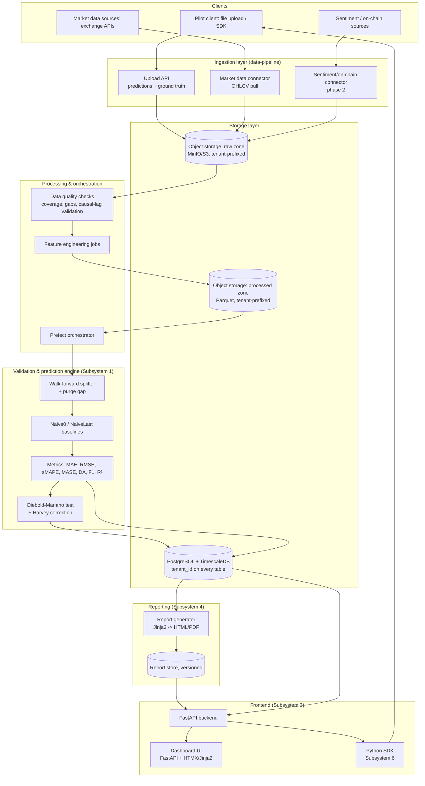

# Solution design — Naive-First platform

> Scope decisions locked in for this design (2026-08-05): local-first deployment (Docker Compose, cloud-portable), **multi-tenant from day one** (external pilot clients submit data/predictions immediately), Python end-to-end with a lightweight server-rendered frontend. Revisit if these assumptions change.

This document covers the technical path from raw data → storage → processing → validation/prediction → reports → frontends, for the subsystems defined in [da-tese-ao-produto.md](da-tese-ao-produto.md) section 2.3: primarily **Subsystem 1 (validation-engine)**, **2 (data-pipeline)**, **3 (dashboard)**, **4 (audit-reports)**, and **6 (api-sdk)**. Subsystem 5 (economic-module) is scoped but deliberately built last, per the roadmap.

---

## 1. Design principles (carried over from the ethical/methodological constraints)

1. **Naive-first is structural, not optional.** Every validation run computes Naive0/NaiveLast baselines automatically — there is no code path that scores a model without them.
2. **No arbitrary code execution from clients in the MVP.** Clients submit *predictions* (CSV/Parquet + ground-truth timestamps), not model binaries. This sidesteps a large sandboxing/security problem and matches the "bring your own model" framing in section 2.3.6 — running client model artifacts is a deliberate phase-2+ decision, not an MVP requirement.
3. **Tenant isolation is a first-class concern from the first commit**, not retrofitted — every table, storage prefix, and API call is tenant-scoped, even though there's only one physical deployment.
4. **Everything the validation engine touches is reproducible and auditable**: every run persists its split boundaries, config (purge gap, horizon), and raw metrics — never just a final report number.

---

## 2. High-level architecture



---

## 3. Component breakdown

### 3.1 Ingestion layer (`data-pipeline/`)

| Component | Responsibility | Notes |
|---|---|---|
| Upload API | Accepts client predictions + ground truth (CSV/Parquet via signed upload or direct POST) | Validates schema with Pydantic (timestamp, horizon, value columns) before landing in raw zone |
| Market data connector | Pulls OHLCV from exchange APIs (e.g. Binance) on a schedule | `ccxt` or direct REST client; idempotent writes keyed by (symbol, timestamp) |
| Sentiment/on-chain connector | Phase 2. Pulls news/social sentiment and on-chain metrics, with **documented causal lag** (timestamp of availability, not timestamp of event) | This is the exact gap the thesis flagged (section 1.6) — the connector must record *when data became known*, not just when it happened, or the leakage problem reappears one layer up |
| Data quality gate | Checks coverage %, gap detection, timestamp monotonicity, causal-lag consistency | Runs before any processed data is exposed to the validation engine; failing datasets are quarantined with a report, not silently dropped |

All ingestion writes land in the **raw zone** first (immutable, tenant-prefixed, source-of-truth) before any transformation — this is what makes runs reproducible and audits defensible ("show me exactly what data this run saw").

### 3.2 Storage layer

| Store | Technology | Contents |
|---|---|---|
| Raw zone | Object storage (MinIO locally, swaps to S3 in cloud) | Immutable landed files: client uploads, raw OHLCV pulls, raw sentiment/on-chain pulls. Path scheme: `raw/{tenant_id}/{source}/{date}/...` |
| Processed zone | Object storage, Parquet | Feature-engineered, split-ready datasets. Path scheme: `processed/{tenant_id}/{dataset_id}/{version}/...` |
| Operational DB | PostgreSQL + TimescaleDB extension | Tenants, users, API keys, dataset metadata, split definitions, run configs, per-split metrics, DM test results, report index. TimescaleDB hypertables for time-series metrics/OHLCV if queried directly rather than via Parquet |
| Report store | Object storage + Postgres index | Generated HTML/PDF audit reports, versioned, tenant-prefixed |

**Multi-tenancy model**: single Postgres instance, `tenant_id` column + row-level security policy on every table (not separate DBs per tenant — simplest operationally for a pilot-stage deployment, still enforces hard isolation). Object storage uses tenant-prefixed paths plus bucket policies. This is the standard "pool" multi-tenancy pattern and is the right choice until a client specifically requires physical isolation (e.g. a large fund with its own compliance requirement) — bridge that with a dedicated bucket/schema per tenant later if it comes up, don't build it now.

### 3.3 Processing & orchestration

- **Orchestrator: Prefect** (not Airflow) — Pythonic, lightweight to run locally via `docker compose`, and its Cloud tier is a clean upgrade path if this needs to run unattended for pilot clients later. Flows: `ingest_market_data`, `ingest_client_predictions`, `run_data_quality_checks`, `run_validation`, `generate_report`.
- **Feature engineering jobs**: pandas/polars transforms producing the processed Parquet datasets; deterministic, versioned by config hash so a run can be reproduced exactly.
- Processing jobs never touch data across the purge gap boundary — this is enforced in the validation engine itself (3.4), not hoped for in the feature code.

### 3.4 Validation & prediction engine (`validation-engine/` — Subsystem 1, core IP)

This is the part to extract from the thesis scripts (`run_arima_returns.py`, `run_rf_noleak.py`, `run_sarima_only.py`) into a standalone pip-installable library, e.g. `naive_first_engine`:

```
naive_first_engine/
├── splitting.py      # rolling-origin walk-forward + configurable purge gap
├── baselines.py       # Naive0, NaiveLast
├── metrics.py          # MAE, RMSE, sMAPE, MASE, DA, F1, out-of-sample R²
├── dm_test.py            # Diebold-Mariano, with Harvey et al. 1997 long-run
                            #  variance correction for overlapping horizons
└── report_schema.py     # typed result objects consumed by report generator
```

- Pure functions, dataset-agnostic (no Bitcoin-specific assumptions), fully unit-testable against known reference values.
- Runs as a Prefect flow: given a processed dataset + config (horizon, purge gap, model predictions), executes the full protocol from section 1.2 and writes per-split results to Postgres.
- This library is also the thing eventually licensed/open-cored per the revenue model (section 2.4) — build it decoupled from the platform's web/API code from the start so it can be published standalone later without a rewrite.

### 3.5 Reporting (`audit-reports/` — Subsystem 4)

- **Report generator**: Jinja2 templates implementing the exact structure defined in the `naive-first-audit` skill (scope, leakage checklist, results table, verdict, statistical-vs-economic disclaimer, recommendations) → rendered to HTML, optionally to PDF via WeasyPrint.
- Reports are generated automatically at the end of a validation run and stored versioned — a client can request a re-audit after fixing an issue and both reports remain comparable.
- The **leakage checklist** in the report is populated programmatically where possible (e.g. "purge gap >= horizon" is a fact the engine already knows) rather than filled in by hand — reduces both effort and the chance of an inconsistent report.

### 3.6 Frontend (`dashboard/` — Subsystem 3, `api-sdk/` — Subsystem 6)

- **Backend**: FastAPI. Endpoints for auth, dataset upload, triggering validation runs, polling run status, fetching reports, dashboard queries (metrics over time per model).
- **Dashboard UI**: FastAPI + Jinja2 + HTMX for the MVP — server-rendered, no separate SPA build/deploy pipeline, fast to iterate on, matches "lightweight web frontend." Pages: tenant login, dataset/run list, run detail (metrics table + DM results, matching the thesis-style tables), report viewer, degradation alerts view (once a model is monitored continuously, per section 2.3.3).
- **Auth**: JWT-based sessions for the dashboard UI, API keys for programmatic access (SDK). `tenant_id` embedded in the token/key, enforced at the API layer and again at the DB row-level-security layer (defense in depth, cheap to add now).
- **Python SDK**: thin wrapper around the FastAPI endpoints (`naive_first_sdk`) — upload predictions, trigger a run, fetch a report — this is what external clients use for the "bring your own model" flow instead of a UI upload.

---

## 4. Data model sketch (Postgres)

```
tenants(id, name, created_at)
users(id, tenant_id, email, role, ...)
api_keys(id, tenant_id, key_hash, created_at, revoked_at)

datasets(id, tenant_id, source, kind[predictions|market|sentiment|onchain],
         raw_path, schema_version, ingested_at)

runs(id, tenant_id, dataset_id, horizon, purge_gap_hours,
     split_config, status, created_at, completed_at)

split_results(id, run_id, split_index, train_start, train_end,
              purge_start, purge_end, test_start, test_end,
              model_mae, model_rmse, model_da, model_f1,
              naive0_mae, naive0_rmse, ...,
              dm_statistic, dm_pvalue, dm_verdict)

reports(id, run_id, version, storage_path, generated_at)
```

`split_results` is intentionally wide and per-split (not just aggregated) — this is what lets the dashboard show "is the model still beating naive this month" (Subsystem 3) rather than only a one-time verdict, and is exactly the artifact the thesis's own appendix was missing (section 1.6, "explainability/artifacts per split").

---

## 5. Deployment (local-first, cloud-portable)

`docker-compose.yml` services for local/pilot deployment:

| Service | Image/base | Purpose |
|---|---|---|
| `api` | FastAPI app | REST API + dashboard (Jinja2/HTMX served from same app initially) |
| `worker` | Prefect agent | Runs ingestion/processing/validation/report flows |
| `postgres` | `timescale/timescaledb` | Operational DB |
| `minio` | `minio/minio` | S3-compatible object storage (raw/processed/report zones) |
| `redis` | `redis` | Prefect task queue / caching (if needed) |

Cloud migration path (no redesign needed, only swaps): `postgres` → managed Postgres/Timescale Cloud, `minio` → S3, `worker`/`api` → containers on ECS Fargate or a small Kubernetes cluster, Prefect local agent → Prefect Cloud or self-hosted Prefect server. Because tenant isolation is already enforced at the data-model level, this migration doesn't require re-architecting multi-tenancy later.

### 5.1 Hosting decision (2026-08-05)

Docker Compose stays the local dev environment (above). For actual hosting, **not Vercel** for the backend: Vercel runs serverless/edge functions and static/SSR frontends, not arbitrary long-running Docker containers, stateful Postgres/Redis/MinIO, or Prefect workers — none of `gateway-api`, `validation-service`, `ingestion-service`, `reporting-service`, Postgres, Redis, or the worker process fit that model.

- **Backend (`gateway-api`, `validation-service`, `ingestion-service`, `reporting-service`, worker, Postgres, Redis)**: deploy to **Heroku** (or an equivalent container-friendly PaaS — Render/Railway are peers if Heroku's pricing/limits don't fit later). Heroku runs the same Docker containers built for local Compose directly, with managed Postgres/Redis add-ons — minimal drift from local dev.
- **Frontend (`dashboard-web`)**: Vercel is a legitimate target *only if* it's rewritten as a Next.js app calling `gateway-api` over HTTPS — the FastAPI+HTMX MVP described in section 3.6 doesn't run on Vercel as-is. Until/unless that rewrite happens, `dashboard-web` deploys alongside the rest of the backend on Heroku too.

Revisit this as an ADR (`docs/adr/`) if it changes rather than silently drifting from it.

---

## 6. Build order (maps to roadmap, section 2.6, adjusted for "external pilots from day one")

1. **`naive_first_engine` library** (3.4) — splitting, baselines, metrics, DM test, unit-tested against the thesis's own published numbers (section 1.3) as a regression check.
2. **Minimal ingestion + storage** — upload API for predictions/ground truth, raw zone, Postgres schema, one Prefect flow (`run_validation`) wired end-to-end for a single tenant.
3. **Tenant/auth scaffolding** — since pilots start immediately, this can't be deferred: tenants/users/api_keys tables, JWT + API key auth, row-level security, before onboarding the first external client.
4. **Report generator** (3.5) — Jinja2 templates matching the skill's report structure, wired to run completion.
5. **Dashboard MVP** (3.6) — run list, run detail, report viewer. This is the client-facing surface for the first pilots.
6. **Market data connector + data quality gate** (3.1) — once predictions-only audits are working, add OHLCV ingestion to support clients who want the platform to source ground truth rather than upload it themselves.
7. **Continuous monitoring** — recurring validation runs on a schedule, degradation alerts, the "is it still beating naive" view — this is what turns a one-off audit into the SaaS dashboard product.
8. **Sentiment/on-chain connectors + economic module** — deliberately after the above, per the original roadmap's phase ordering.

---

## 7. Open questions to resolve before build starts

- **Report delivery format for pilots**: HTML-in-dashboard only, or also downloadable PDF? (Affects whether WeasyPrint/wkhtmltopdf needs to be in the stack from day one.)
- **Client prediction submission cadence**: one-off audit only, or recurring feed (needed for Subsystem 3's continuous monitoring) — determines whether the upload API needs to support streaming/incremental uploads early or can start as one-shot batch files.
- **Pilot client count and expected data volume** — affects whether local Docker Compose can carry the actual pilot phase or whether cloud deployment needs to happen sooner than "phase 2."
